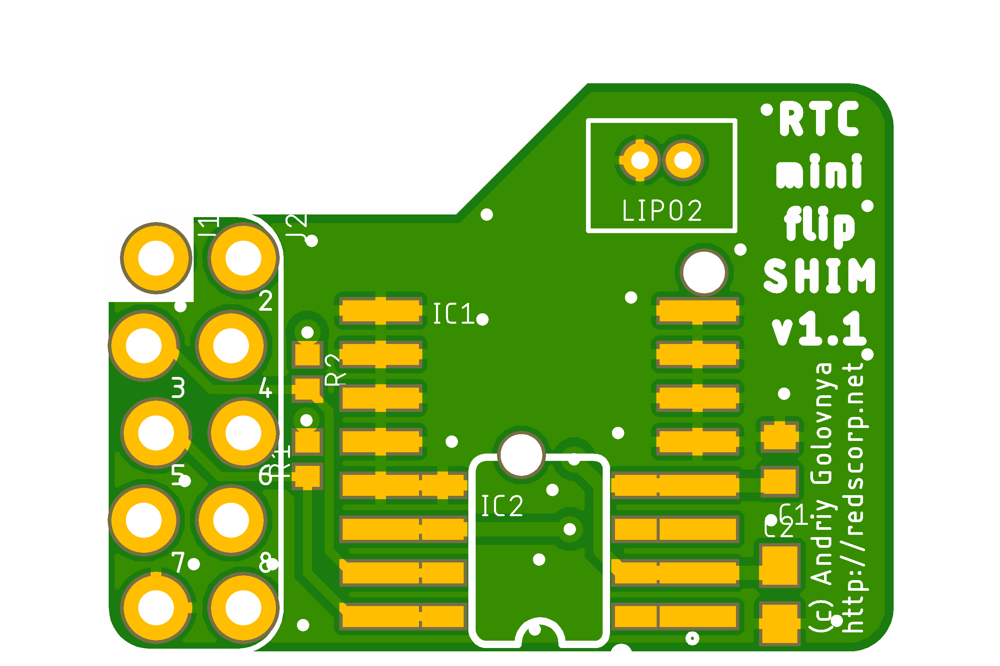

# RTC-SHIM project

My RTC-SHIM (mini-HAT) for Raspberry Pi project.

"How did it come to this?" you may ask.
The answer is simple.
I was pissed off by the fact the several Pis I have all have the same issue.
They lose time information when they switched off and need Internet to set proper time again.
The obvious reason for this is lack of RTC chip and backup battery to count time when main CPU of Pi is off.
This is how it's done in all modern PCs and notebooks (and Macs too).
I've searched Internet and found no solution which suits my needs.

- The RTC board should be mounted on 40-pin connector of Raspberry Pi (like 2, 3, 4, zero have).
- The board should be mechanically and electrically compatible with all modern Pis (3+, 4, zero WH).
- The board should be mounted inside or outside the Pi's case.
- There should be possible to put some Pi HAT (Hardware Attached on Top) on top of the board (like LCD display, LoRa, LEDs array or 3G/4G modem HATs).
- The board should be obviously small enough to fit in case of Pi.
- The board should have a battery holder or/and a common notebook BIOS battery connector.
- The board should be easy to setup under Pi's Linux (like Raspbian or Ubuntu).
- The board should be cheap to buy or/and easy to manufacture by (my) hand at home.

Some useful link:

- [pinout.xyz](https://pinout.xyz/) - a brilliant resource on topic of Pi's pinout and HATs.
- [RPI_RTC_Module_SKU:EP-0016](https://wiki.52pi.com/index.php/RPI_RTC_Module_SKU:EP-0016) - some RTC schematics and setup info.
- [Raspberry Pi RTC: Adding a Real Time Clock](https://pimylifeup.com/raspberry-pi-rtc/) - RTC setup info.

And gradually I came out with few designs presented here.

## RTC-SHIM

Raspberry Pi 40-pin **RTC-SHIM** mini-HAT.

Preview:

Features:
- DS3213 RTC chip
- CR1220 3V battery
- locked Pi headers
- double set of Pi headers (for inside and outside mount)
- I2C0/I2C1 bus selection
- can be used as SHIM (no headers) or HAT (with headers)
- optional external notebook BIOS battery connector

## RTC-mini-flip-SHIM

Raspberry Pi **RTC-mini-flip-SHIM** micro-HAT.

Preview:

Features: 
- DS3213 RTC chip
- CR1220 3V battery
- locked Pi headers
- double mount on Pi headers (for inside and outside mount)
- very small size
- fits on 26- and 40-pin Pi headers
- optional external notebook BIOS battery connector (two side mount)

CAM files are available.

## How to help

Your contributions as code, resources or finances are welcome!
Please contact me directly over e-mail andriy.golovnya@gmail.com or over [GitHub profile](https://github.com/red-scorp).
Link for [Paypal donations](http://paypal.me/redscorp), which are always welcome.
Thanks in advance!
